# Building the FauxVT
These instructions are a work-in-progress. As problems are noted or suggestions arise, I will update the instructions as I have time. Thank you for your patience. Throughout the Instructions when I am referring to a printed part, I will italicize the name. For example: *Top Case*. Below are some reference images of the assembled model. 

[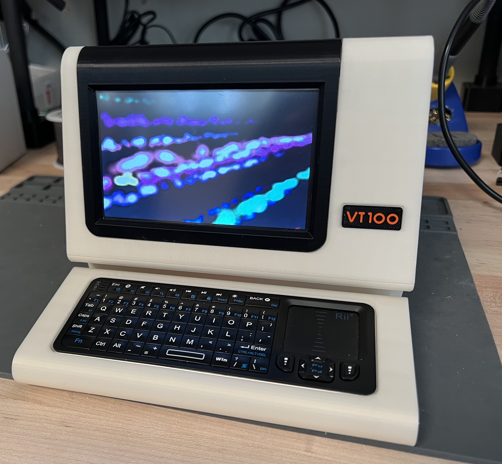](images/Actual/Front_1.jpeg)
[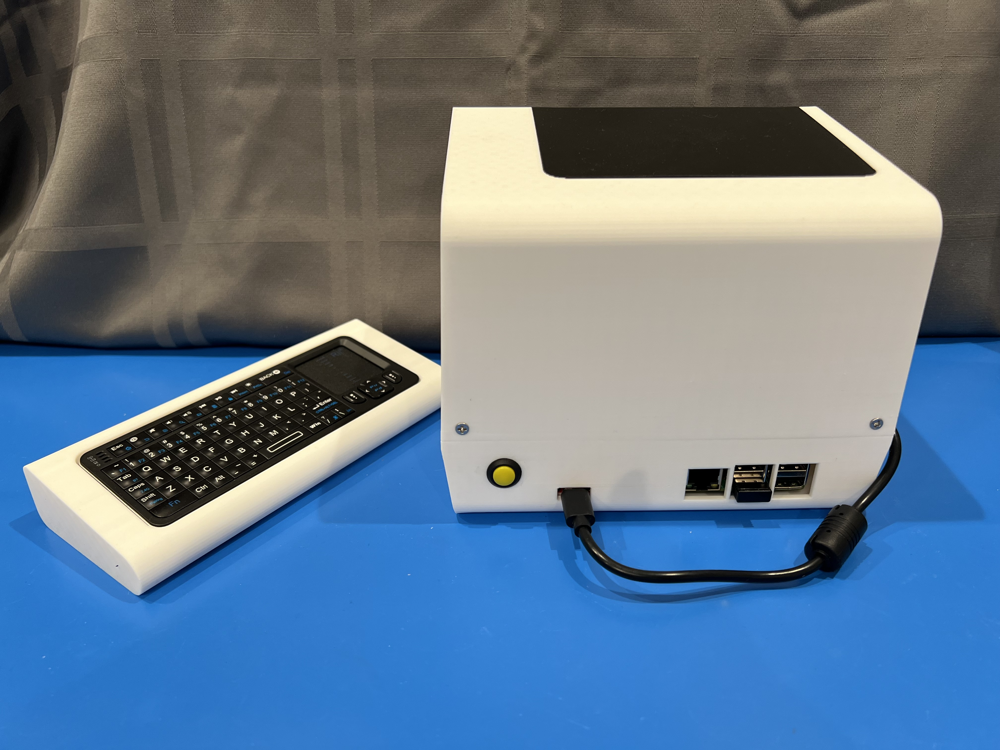](images/Actual/Back_1.jpeg)

[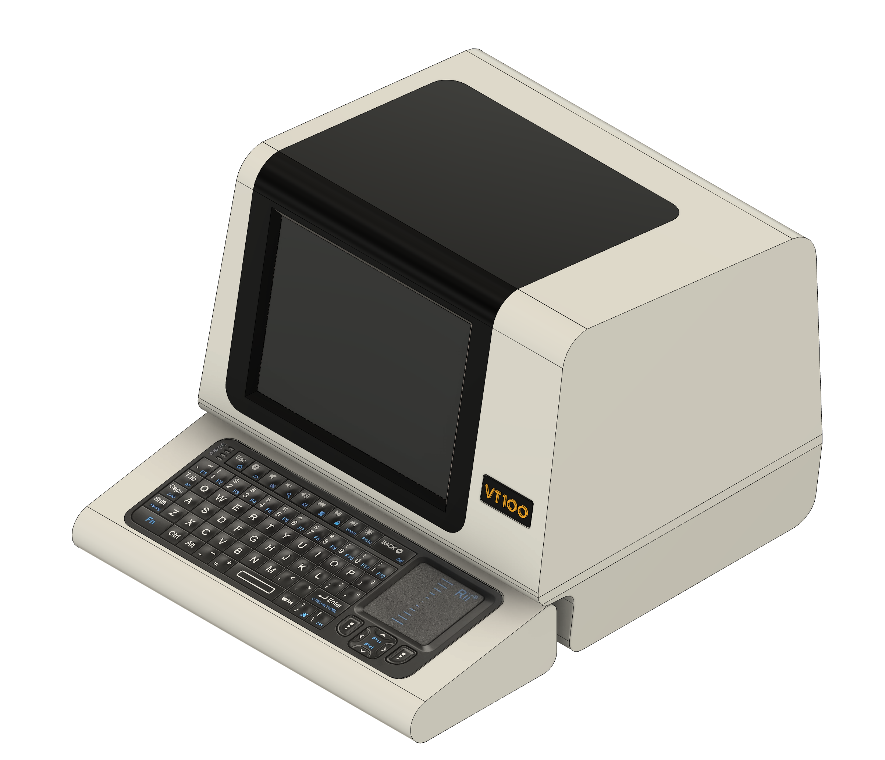](images/Model/Full_Front.png)
[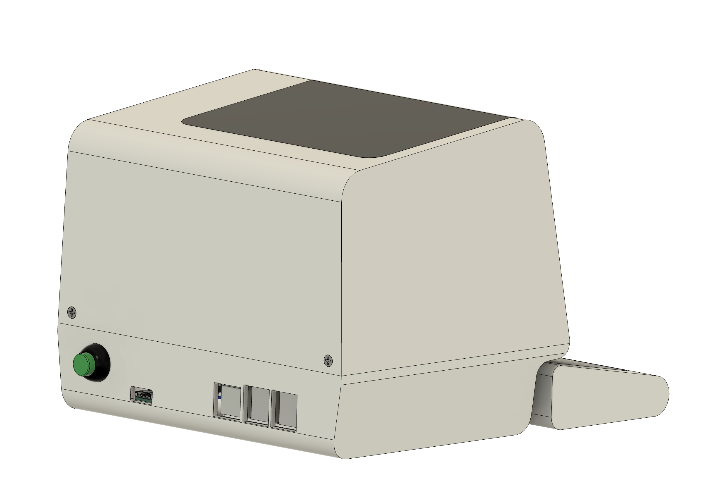](images/Model/Full_Back.png)

## Required Supplies

### Required Electronics

* **Raspberry Pi 3/4/5**. I use a model 3 and find the performance adequate. There are many places to source these. To find one you can use [rpilocator](https://rpilocator.com/).
* **Power Supply**. You will need a power supply with a USB-C connector that can support the Raspberry Pi and the display. The Pi is fairly power hungry so don't skimp here. If you do, you are likely to get "Low Voltage" warnings from the Pi. The [CanaKit Pi 4 Power Supply](https://www.amazon.com/gp/product/B07TYQRXTK) has worked for me, though I'm sure there are many others that will also work. What won't work is an old phone charger with a random USB cable.
* **5" 640x480 Display**. I used a 4x3 display to get the shape closer to the original aspect ratio, though still not quite as square. These are more difficult to find, but they are [available on eBay](https://www.ebay.com/itm/126148049546) along with the controller board which has an HDMI interface.
* **Keyboard**. The actual VT100 has a detachable keyboard as does FauxVT. In the model, the keyboard unit has a slot for a small wireless keyboard. The model I used will operate using Bluetooth or an included RF dongle. The model I used can be found on [AliExpress](https://www.aliexpress.us/item/3256805302970479.html).
* **USB-C breakout board**. This board fits in the *Bottom Case* and is the power jack for the model. You can find the board I used on [Amazon](https://www.amazon.com/dp/B09BW3HG49).
* **HDMI Cable**: The display connects to the Raspberry Pi via HDMI, but there is not any space for the typical bulky HDMI cables. I used a flat-flex cable with an up-angle HDMI connector for the display. The other end of the cable will depend on which Pi you use. I used a Flat-flex cable similar to [this one](https://www.amazon.com/JSER-HDMI-Type-Male-Cable/dp/B071FJY2BB), but with a micro-hdmi connector on one end. You can mix and match ends or buy a cable with both ends supplied (check the supplier's Amazon store). Be very careful to get the right one for your setup.
* **Power switch**. You need a standard latching push button. The one I used can be found on [Amazon](https://www.amazon.com/Cylewet-Self-Locking-Latching-Button-CYT1091/dp/B075VBV4QH).
* **Boost Converter**. The display runs on 12V, so you'll need to boost the 5V supply coming in. There are lots of available boost converters. The *Bottom Case* has mounting spots for [this one](https://www.amazon.com/gp/product/B0833SQF8Z).
* **Wires**
	* **USB Cable End**: I powered my Pi by plugging a USB cable into it as usual. I just used the end of a Micro-USB cable (since I used a Pi 3) and connected that to the incoming power through the switch.
	  * **Important**: Be sure to use a good cable. Even at this short length, a cable with very thin wires will cause a voltage drop which will be reported by the Pi.
	* **Various bits**. You'll need a few bits of wire to connect the breakout board, through the switch, to the Pi (via USB cable mentioned above) and the Boost converter. You'll also need wire to connect the output of the boost converter to the display.
	* **Barrel Jack**. You may wish to use a barrel jack to connect the boost converter to the display. I decided to solder wires to the display board rather than use a jack, but that  is up to you.

### Required Hardware

You will need an assortment of screws to assemble the model:

* (4) M3x8 countersunk screws
	* (2) to attach the front of the *Bottom Case* to the front of the *Top Case*.
	* (2) M3x8 countersunk screws to attach the rear of the *Top Case* to the rear of the *Bottom Case*.
* (4) M3x4 cap head screws
  * (2) for the USB-C breakout board
  * (2) for the Boost Converter
* (4) M2x4 cap head screws to attach the Raspberry Pi to the *Bottom Case*.
* (4) M3x4 cap head screws to attach the display board to the *Display Retainer*
* (4) M3x6 cap head screws to attach the *Display Retainer* to the *Top Case*

Refer to the [reference images](#ScrewPlacement) in the Assembly section for placement.

### Filament

I used PLA for all components, but for no other reason than it is what I normally use and my models won't be in an environment where the properties of other filaments will be required. If this turns out to be untrue, I will update this note.

* **White Filament**: The *Top Case*, *Bottom Case*, and *Keyboard Shell* should be printed in White Filament to match the VT100. I am looking for suggestions on which specific filament matches the VT100 best. If you know of a matching paint, you could print the model in a neutral white and spray paint it. If you do this, you'll need to be careful about the tolerance of the fit between the Top Case and the Insert.
* **Black Filament**: This is used for the *Insert* and part of the *Badge*. You can also use black, or any other color filament, for the internal parts such as the *Display Retainer*.
* **Orange Filament**: A very small amount of orange filament is need for the lettering on the *Badge*.
* Thanks to [research](https://github.com/larsbrinkhoff/terminal-simulator/issues/31) by Lars Brinkhoff, we have better data on the actual colors of the VT100 so we ought to be able to find a closer filament match. Specifically, the *Top Case* and *Bottom Case* are closest to one of these Pantone colors: Pantone 2323 C, 7527 C, and 7534 C. The dark parts (e.g. *Insert* and *Badge*) are close to Pantone 412 C.

### Other
* **CA Glue**: A small amout of CA glue is needed to attach the *Insert* to the *Top Case*.
* **Patience**: This can go a long way towards a successful build.

## Printing the Parts

Printing and assembling this model will take some time. The largest part, the main case, requires supports and takes me about 10.5 hours to print on a BambuLab X1. All of the STLs will import into your slicer in the orientation in which I printed them. STLs that need supports have “(NS)” in the name. I used tree support and removing them wasn't too bad. All parts may be printed with a 0.2mm layer height.

* ***Badge.stl***: Print the *Badge* with black filament up to the 1.2mm height, then switch to orange filament for the remainder. Use your slicer to set a pause so you can change filament, or use a multi-filament printer.
* ***Bottom Case (NS).stl***. This component requires supports to hold up the front lip. Note that there are two screw holes in this lip which have built-in single layer (0.2mm) bridges. This avoids supports in a hard-to-cleanout area. Simply poke a small hex key through the bridged area after printing. 
* ***Display Retainer (NS).stl***. This part screws into the main case and the Front Insert to hold the display in place. It also provides a spot to mount the controller board for the display. It requires supports, but they are minimal and easy to remove. I used slim tree supports.
* ***Insert (NS).stl***. This component fits into the opening of the *Top Case* and provides the bezel for the screen. It requires supports along one edge of the bezel.
* ***Keyboard Shell (NS).stl***. This standalone component houses the small wireless keyboard. It is listed as requiring supports, though technically it doesn't if printed in it's natural orientation. I print it on end to avoid stair-step ridges in the top of the shell. You can re-orient it to avoid supports if you prefer.
* ***Top Case (NS).stl***. This is the largest single print and, as the name shows, requires supports. Though this part can be printed at a 0.2mm layer height, the top has a gentle slope which may create visible ridges. You may choose to print this section of the model with a smaller layer height to mask the stair-step effect.

## Assembly

After printing the parts, removing supports, and doing any other cleanup/post-processing you see fit, you are ready to assemble the model. The steps below are for the physical assembly, but you'll need to do the wiring along the way. An overview of the wiring is given in a separate section, but is called out in step 8 below.

1. All of the screws mount directly into the plastic of the model. You may want to run some screws into the holes a bit to make it easier to start the screws during the actual assembly process. Do no over-tighten.
1. Position the *Insert* into the opening in the *Top Case*. Adjust the fit so that there is little to no space between the parts. When you're happy that it fits well, remove it and put a small amount of CA glue on the three support tabs. From the inside of the case, use more CA glue on the seam between the *Top Case* and the *Insert*. See the reference images below.
2. Using a small amount of CA glue, affix the Badge into the recessed area on the *Case* to the right of the display opening.
1. Very carefully thread the flat-flex cable from the display through the *Display Retainer* and connect it to the connector on the display board. It is very easy to rip this cable and extremely hard to fix it. See the photos for proper orientation.
  * **NOTE**: At this point you should have soldered wires to the back of the display board if you are not going to use the barrel connector (see wiring notes below).
1. Screw the display board to the back of the retainer. Use at least 2 screws, but preferably all 4.
1. Install the display, display board, and *Display Retainer* into the case. Install four screws through the *Display Retainer* into the tabs at the front of the *Top Case*. Remember to peel off the clear protective plastic from the front of the display before you screw it in place.
  * **NOTE**: The display board comes with a control board with several buttons. The boards are connected to one another through a fairly flat 6-wire cable. You won't be using the control board in normal operation, but it is useful to have it connected during initial setup to adjust things like input source, brightness, etc. It is tough to connect the cable once the display is installed. You may wish to plug in the cable before installing the display assembly. You don't need to leave the control board connected after initial setup, but you can leave the cable installed.
1. Install the Raspberry Pi using four M2 screws.
1. Install the power switch
1. ***Perform wiring as described below***
1. Secure the USB C breakout board using two M3 screws
1. Secure the Boost Converter using two M3 screws
1. After testing the unit, secure the *Top Case* to the *Bottom Case* using two screws at the front and two are the back.
2. Have a break then move on to Software Setup.

**Reference Images**:

[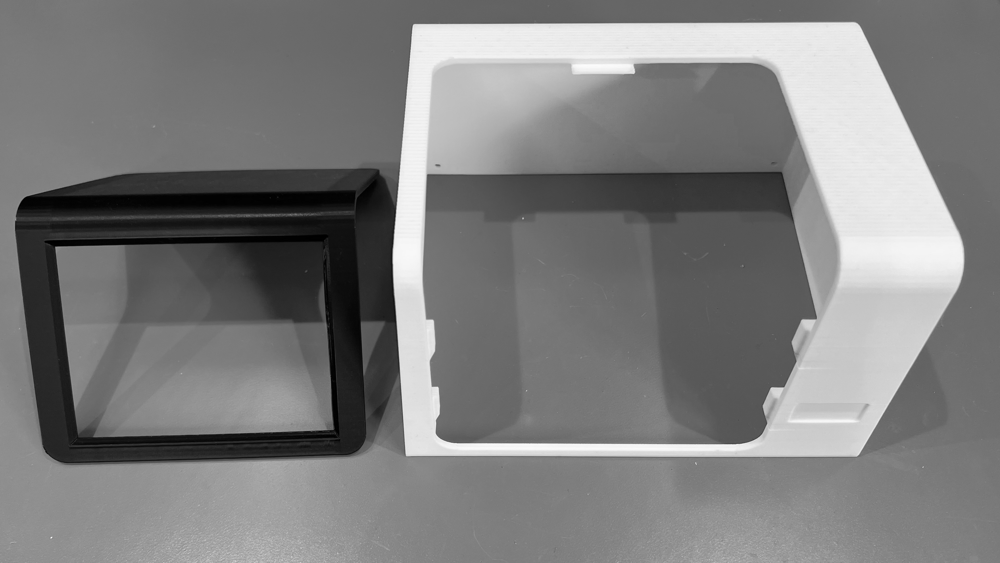](images/Assembly/Case_Bezel_Separate.jpeg)

[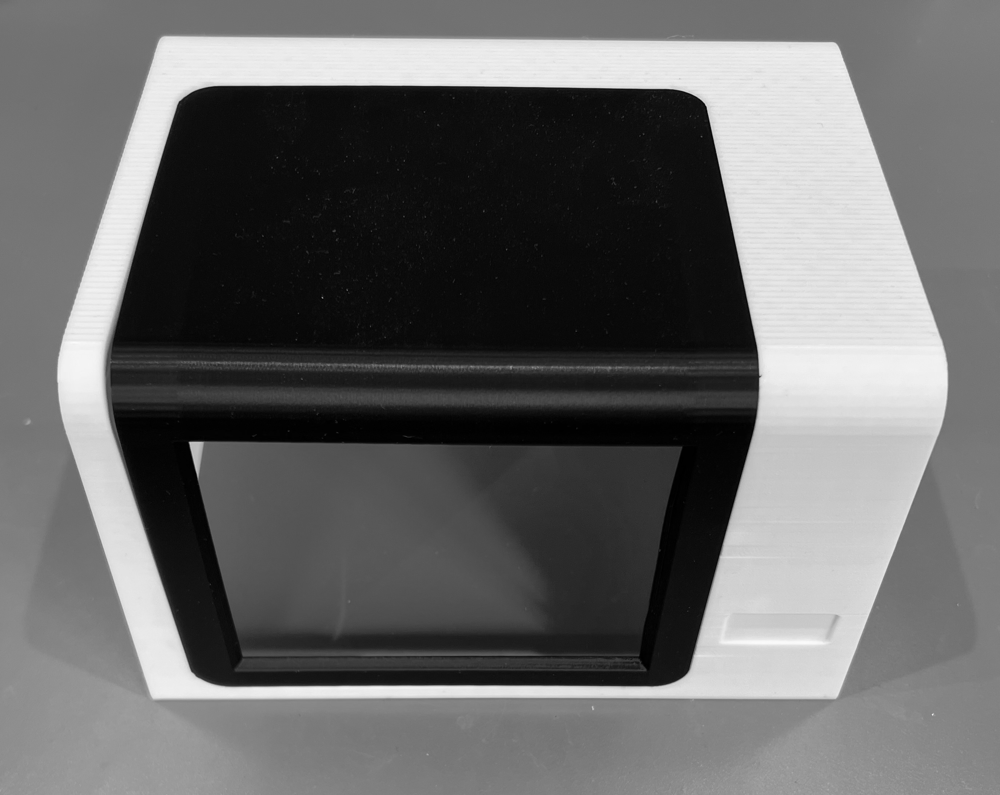](images/Assembly/Case_Bezel_Joined.jpeg)
[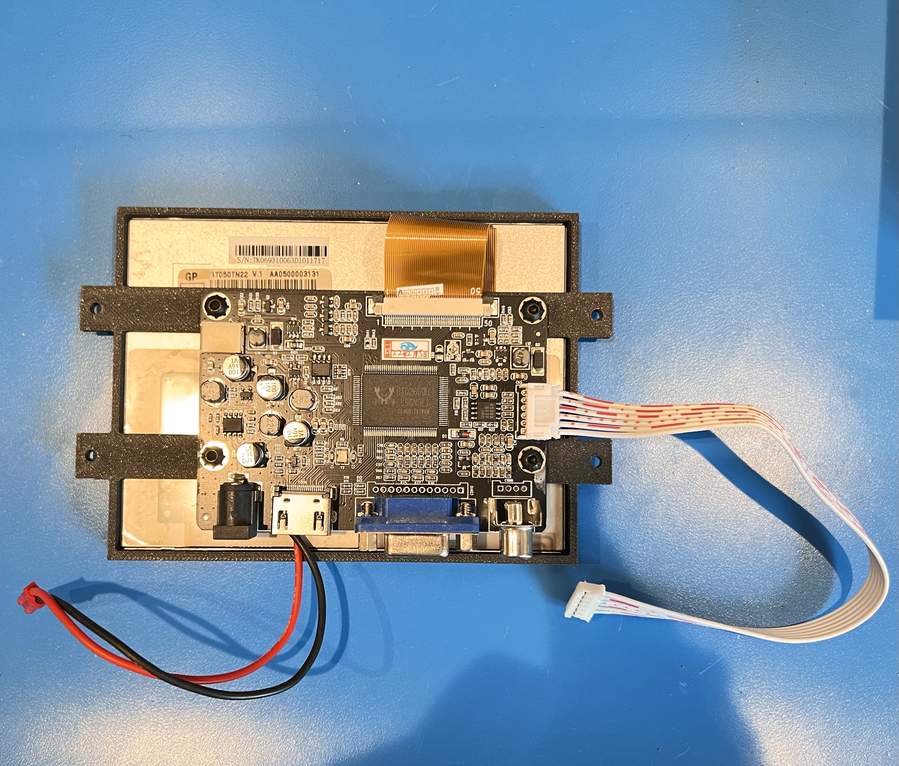](images/Assembly/Display_Board_with_connector.jpeg)
[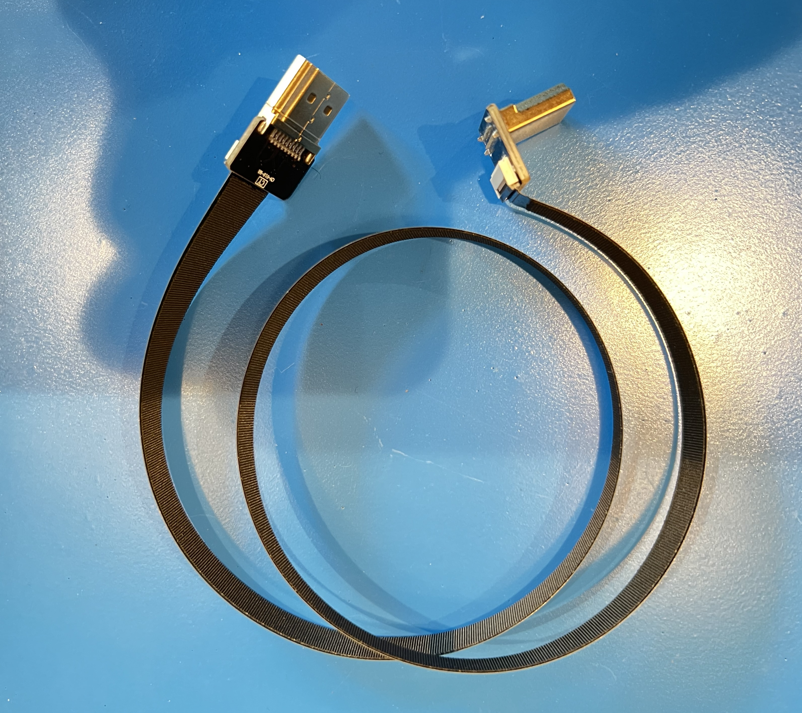](images/Assembly/HDMI_Cable.jpeg)

Screw Placement:

[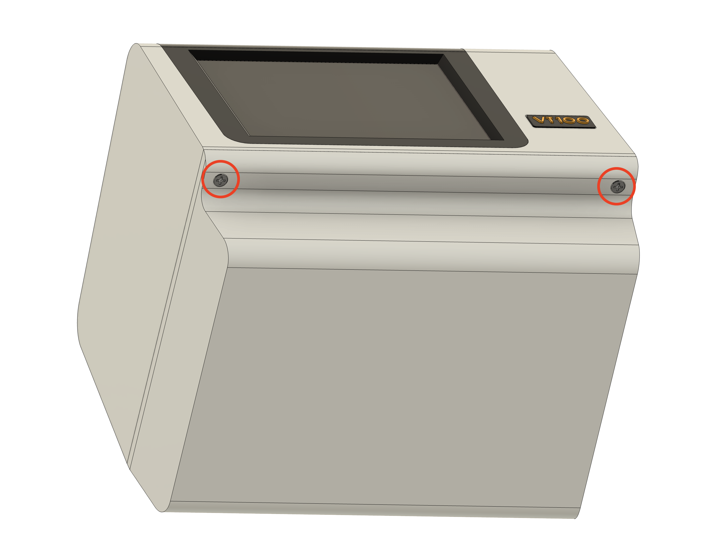](images/Assembly/HW/Bottom_Assm_Screws_2.png)
[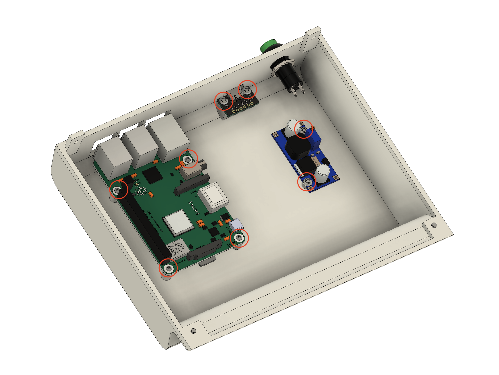](images/Assembly/HW/Bottom_Assm_Screws.png)
[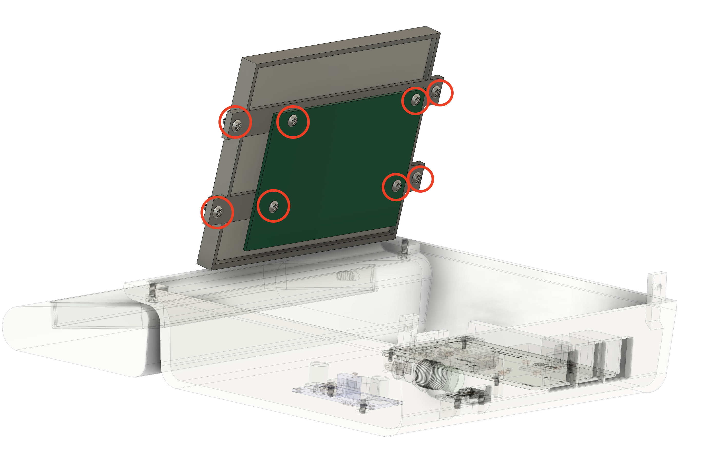](images/Assembly/HW/Display_Assm_Screws.png)
[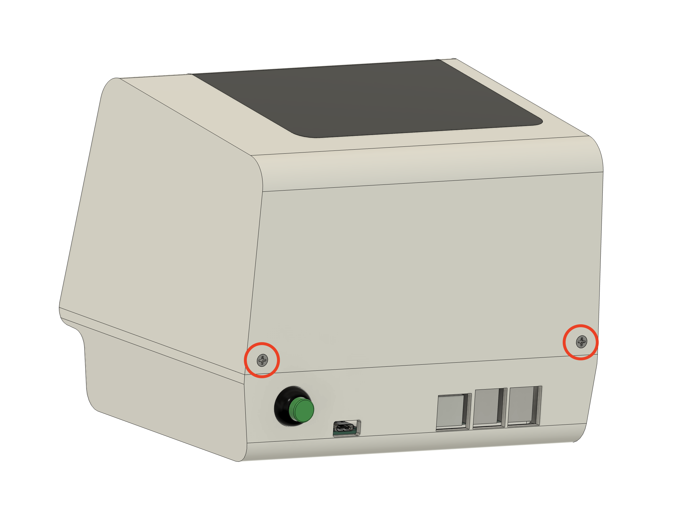](images/Assembly/HW/Top_Assm_Screws.png)

## Wiring

The wiring is fairly simple. You can see most of it in the photos. I will trace through the connections starting with the USB-C connector. Depending on how much you want to facilitate disassembly and changes, you may wish to use two prong connectors at certain spots. Refer to the images to see where I used connectors.

1. Connect `VBUS` on the USB breakout board to one leg of the power switch.
1. Connect the other leg of the power with to the positive (red) leg of the USB Cable End.
1. Also connect the same leg of the power switch to `IN+` on the Boost converter.
1. Connect `GND` on the USB breakout board to `IN-` on the Boost converter.
1. Also Connect `GND` on the USB breakout board to to the ground (usually black or white) leg of the USB Cable End.
1. Output from the Boost Converter. You have a couple of options here:
    2. Connect the outputs of the boost converter (`OUT+` and `OUT-`) to a cable with a male barrel connector on the end. It should correspond to the female barrel connector on the display. Plug in the barrel connector.
    3. *Alternatively*, solder a red wire and a black wire to the back of the display board. If you look at the board near the barrel jack you'll see pads labeled `12V` and `GND`. You can use those or solder directly to the  legs of the barrel connector. If you use this method, it is convent to put some type of 2-pin connector between the Boost converter and display so they can be separated easily. This is the approach I took. See the reference photo.
    4. **Important**: Adjust the Boost Converter output to 12V. If the voltage is too high, it may damage your controller board.
1. Connect the angled HDMI connector to the input of the display board.
1. Connect the free end of the HDMI cable to the Raspberry Pi.
1. Plug the USB Cable End into the Raspberry Pi.

**Reference images**:

[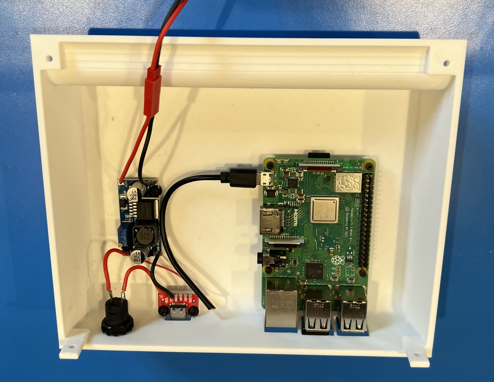](images/Wiring/Bottom_Wiring.jpeg)

## Software Setup

* **Prepare Raspberry Pi OS**. Create an image of the Raspberry Pi OS that is appropriate for your Pi. Don't use the Lite version - you'll need the window system installed.
* **Flip the display**. Because of the placement of ports on the display, it must be mounted upside down in the case. This means that the displayed images need to be inverted. This is accomplished using the Screen Preferences in the Raspberry Pi desktop. Selected the inverted option.

	[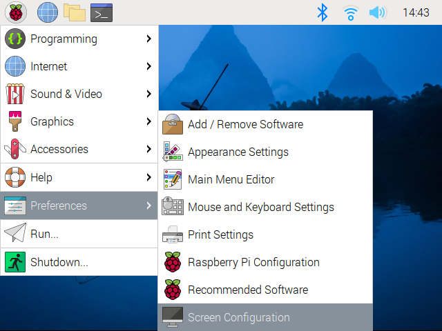](images/SW/ScrPrefs.png)
	

  Once you've done this, the Window System will display properly. Note, however, that as the Pi is booting, everything will appear upside down until the window system launches.
* **Install a Terminal emulator**. These are the two terminal emulators I recommend:
    * The first is the wonderful [VT100 Simulator](https://github.com/larsbrinkhoff/terminal-simulator) by [Lars Brinkhoff](https://github.com/larsbrinkhoff). It is a faithful software simulation of the VT100 hardware including the original firmware ROM. Do you want to get in and use the setup menus like the old days? This is the way to go! Lars points at that the simulator is "somewhat experimental and the performance running on a Raspberry Pi could use some attention from an expert."
    * The second is the very aptly named [**C**ool-**R**etro-**T**erm](https://github.com/Swordfish90/cool-retro-term) by [Filippo Scognamiglio](https://github.com/Swordfish90). From GitHub: "cool-retro-term is a terminal emulator which mimics the look and feel of the old cathode tube screens. It has been designed to be eye-candy, customizable, and reasonably lightweight."
* Optional: Create desktop icons for your terminal emulators, or choose one and automatically launch it full screen when the window system launches.
