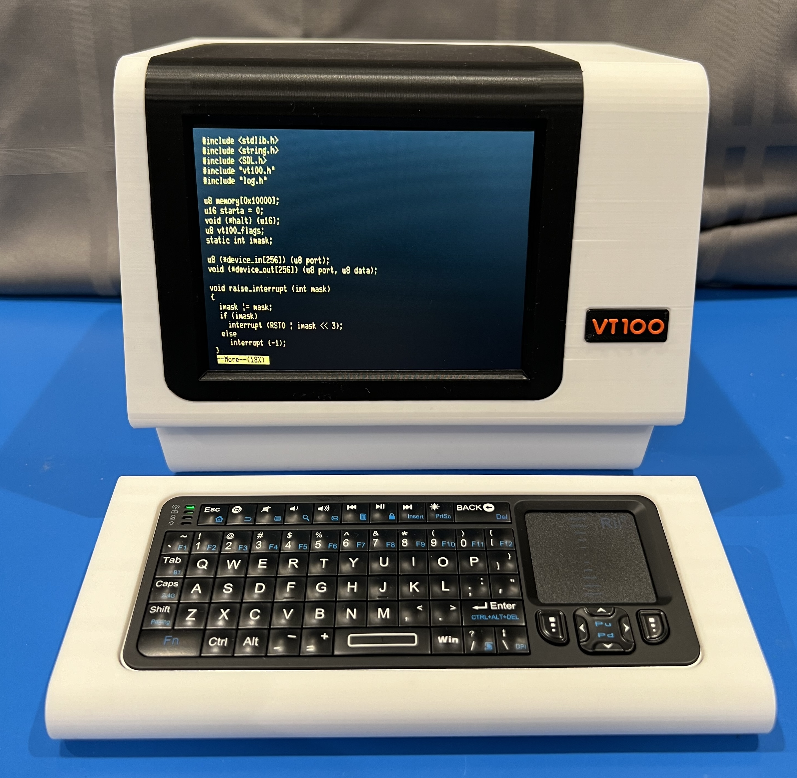

# FauxVT

This repository contains the instructions for building a Faux VT100. The model is meant to evoke the feel of a [DEC VT100 terminal](https://www.vt100.net), but is not an exact replica. It has mounting spots for a Raspberry Pi, display, and associated hardware that allow you to run a terminal emulator and get the true VT100 experience.

There are two terminal emulators that make good choices for the FauxVT:

* The first is the wonderful [VT100 Simulator](https://github.com/larsbrinkhoff/terminal-simulator) by [Lars Brinkhoff](https://github.com/larsbrinkhoff). It is a faithful software simulation of the VT100 hardware including the original firmware ROM. Do you want to get in and use the setup menus like the old days? This is the way to go!
* The second is the very aptly named [**C**ool-**R**etro-**T**erm](https://github.com/Swordfish90/cool-retro-term) by [Filippo Scognamiglio](https://github.com/Swordfish90). From GitHub: "cool-retro-term is a terminal emulator which mimics the look and feel of the old cathode tube screens. It has been designed to be eye-candy, customizable, and reasonably lightweight."

Take a look at a [short video](https://www.youtube.com/watch?v=NNNNN) of the model in operation.

**[Instructions](Instructions.md)**: This document desribes how to print, assemble, wire, and prepare software for FauxVT.

***NOTE: THIS IS A WORK IN PROGRESS***

The documentation on required electronics, wiring, and software setup is not complete. At this point you should consider yourself an alpha-tester!

The STL files for FauxVT can be found on [printables](https://www.printables.com/model/NNNNN).

***This model may not be used for commercial purposes as noted in the license***.
